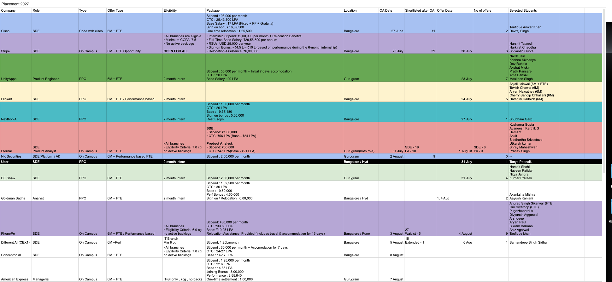
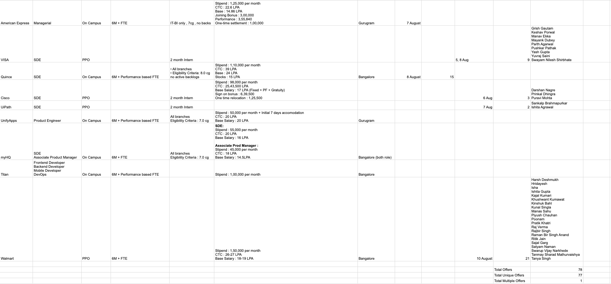

# Placement 2027

A lightweight, responsive website for viewing the Placement 2027 records in full resolution.

## Preview

### Sheet 01

### Sheet 02

## Deploy on Vercel

Import this GitHub repository into Vercel and click **Deploy**. No build command or environment variables are required.

The website is a static deployment consisting of `index.html`, `vercel.json`, and the two original PNG files.
